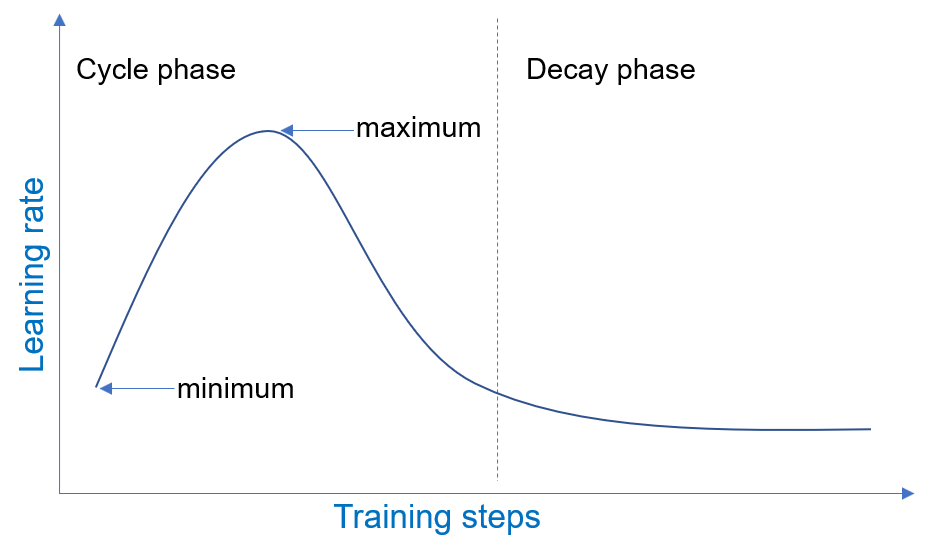
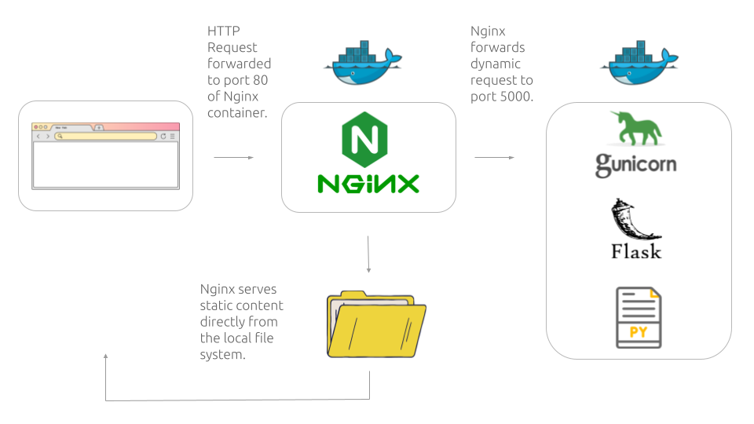

<h1 align="center">
Caption Generation Model
</h1>

<p align="center"> </p>


<p align="center">
  <a ></a>
  <a ></a>  
  <a ></a>
  <a ></a>
  <a ></a>

</p>

<p align="center">
   <a href="http://13.50.96.179"">
   
  </a>
   <a href="http://13.50.96.179"">
   
  </a>
</p>


<br>

## About 📃 

> Image Captioning task generates text description for a given image which requires understanding of both Computer Vision and Natural Language Processing (NLP) fields, because it learns the neural representation  in both the image and the text and the relationship  between the visual features derived from the first and the semantic information derived from the latter. This eventually leads to the semantic understanding of images by the model.

<br>

**TL;DR** : It contains a fully customizable DL pipeline that ensures  reproducibility and modularity, it covers designing an end-to-end training pipeline including language and vision data processing, model architecture development implemented in Pytorch, training, transfer learning, evaluation, as well as monitoring and logging and also inference.


Additionally, I developed an API deployment process by building a production environment within an AWS EC2 instance with containerization to ensure the application works seamlessly across different environments, the application is built using Flask, Gunicorn, Nginx, Docker and Docker-compose.


Please note that my model's performance was constrained by limited compute resources and having access to better resources would likely lead to improved performance, whether through training on larger datasets, increasing the complexity of the model or training for longer duration.

For more  information, please refer to the README description below.

<br>

## Installation ⚒️
Create and activate a Conda virtual environment:

  ```
  conda create -n web_app_env python=3.8
  conda activate web_app_env
  ```

Clone the repository and install requirements:
  ```
  git clone https://github.com/Manalelaidouni/CaptionCode.git
  cd caption/flask-app
  pip install -r requirements.txt
  ```

To run inference, install torch with cpu only:
  ```
  pip install torch==1.10.1+cpu torchvision==0.11.2+cpu --index-url https://download.pytorch.org/whl/cpu
  ```

To train the model using gpu, install torch gpu version with cuda using the following command:
  ```
  pip install torch==1.10.1+cu102 torchvision==0.11.2+cu102  --index-url https://download.pytorch.org/whl/cu118
  ```

Download data needed for this project (Flickr8k dataset and Glove pre-trained embeddings) into  `Data` folder using  `download_data.sh ` script:
  ```
  cd script
  chmod +x download_data.sh
  ./download_data.sh
  ```

<br>

The following scripts use packages in your conda environment, to activate the conda environment you created earlier within the shell session, we need the path to your `conda.sh` script installation location, this script is located in the `etc/profile.d/` directory of your Miniconda or Anaconda installation, make sure to use the absolute path.
 

To generate necessary pickles for pre and post-processing, run the following shell script :

  ```
  chmod +x create_vocab.sh
  ./create_vocab.sh '<path_to_conda_install>' '<conda_env_name>' 
  ```
Here is an example:
  ```
  ./create_vocab.sh '~/miniconda3/etc/profile.d/' 'web_app_env'
  ```


<br>

Similarly, to create the embedding matrix needed for inference, run the following shell script :
  ```
  chmod +x create_embed_matrix.sh
  ./create_embed_matrix.sh '<path_to_conda_install>' '<conda_env_name>'
  ```

<br>

Run inference on a specific image:
  ```
  python train.py --inference=True --inference_image=./static/uploads/boys.jpg
  ```

Train for a specific number of epochs from scratch:
  ```
  python train.py --train_network=True --epochs=10
  ```

Resume training from checkpoint:
  ```
  python train.py --resume_training=True --epochs=10
  ```

<br>

> *To run Learning Rate Finder*:


To setup LR Finder for training using a shell Script use the following commands, this will generate a plot like [this](https://github.com/Manalelaidouni/Caption-Web-App/blob/main/plots/lr_finder.png) one and  save it to `plots` folder :

  ```
  chmod +x run_LRFinder.sh
  ./run_LRFinder.sh
  ```

Alternatively, you can run it directly from python script using the following command :
  ```
  python train.py --lr_finder=True
  ```

<br>
<br>

> *For further training customization, you can either use:*


- **Configuration file**: You can run training customizations by editing the configuration files in the `configurations` folder. Note to use `config-defaults.yaml` when using wandb and `config-defaults.yaml` when not. 
I have created two separate YAML files so I can access configuration variables throughout the code using dot notation, such as `cfg.epochs`, however wandb uses dictionary access syntax like `cfg['epochs']`. This approach allows me to maintain consistent code regardless of whether wandb is used or not.


- **Command line arguments**: Alternatively, you can use command line arguments to customize training, here is the optional arguments in the following toggle block:

<details>
<summary>CLI Usage</summary>

```
Command line interface for Caption web app.

Optional arguments:
  --use_wandb               Use Weights and Biases
  --project                 Wandb project name
  --tag                     Wandb tag
  --notes                   Notes for the run
  --log_wandb_freq          Frequency to log to Wandb
  --parse_args              If args should be parsed for a bash script
  --checkpoint_fname        Checkpoint filename
  --CHECKPOINT_PATH         Path to weights checkpoint
  --IMG_PATH                Path to image data
  --TEXT_PATH               Path to text data
  --GLOVE_PATH              Path to GloVe embeddings
  --torch_hub_dir           Torch Hub directory
  --torch_hub_model         Torch Hub model
  --pretrained              Use pretrained model
  --FINETUNE_ENCODER        Finetune encoder
  --encoder_dim             Encoder dimension
  --decoder_dim             Decoder dimension
  --attention_dim           Attention dimension
  --embed_dim               Embedding dimension
  --hidden_dim              Hidden dimension
  --depth                   Depth
  --encoder_size            Encoder size
  --mixed_training          Mixed training
  --batch_first             Batch first
  --num_layers              Number of LSTM layers
  --bidirectional           Bidirectional LSTM
  --use_glove_embeddings    Use GloVe embeddings
  --finetune_embedding      Finetune embeddings
  --use_attention           Use attention
  --use_one_network         Use one network
  --teacher_forcer          Teacher forcing ratio
  --encoder_lr              Encoder learning rate
  --decoder_lr              Decoder learning rate
  --remove_punct            Remove punctuation
  --lemmatize               Lemmatize
  --stemmize                Stemmize
  --remove_stopwords        Remove stopwords
  --remove_numbers          Remove numbers
  --track_metric            Tracking metric
  --batch_size              Batch size
  --test_batch_size         Test batch size
  --shuffle                 Shuffle data
  --transform_input         Transform input data
  --plot_name               Plot name
  --epochs                  Number of training epochs
  --use_amp                 Use Automatic Mixed Precision (AMP)
  --momentum                Momentum
  --optim                   Optimizer
  --resume_training         Resume training
  --learning_rate           Learning rate
  --use_scheduler           Use learning rate scheduler
  --scheduler               Learning rate scheduler type
  --sched_patience          Scheduler patience
  --lr_finder               Use learning rate finder
  --weight_decay            Weight decay
  --dropout                 Dropout rate
  --checkpoint              Checkpoint saving
  --save_to_wandb           Save to Weights and Biases
  --seed                    Random seed
  --clip                    Gradient clipping threshold
  --cuda                    Use CUDA if available
  --early_stop              Early stopping
  --patience                Patience for early stopping
  --mode                    Mode for early stopping (min or max)
  --validate                Validation mode
  --inference               Inference mode
  --train_network           Training mode
  --num_workers             Number of workers for data loading
  --inference_image         Path to image to run inference on
```
</details>

<br>


## Project Description 📝

### Data Description 🗂️

The Flickr8k dataset is provided by Jason Brownlee on <a href="https://github.com/jbrownlee/Datasets/releases/download/Flickr8k"> Github</a>, the dataset contains 8091 images and up to five captions per image and it's is organized as follow: 

Inside `Flickr8k_text` folder, the image filenames for each split are grouped into separate files `trainImages.txt`, `devImages.txt`, `testImages.txt`, while the file `Flickr8k.token.txt` contains a compilation of image filenames paired with their respective captions. For every image across all splits, the filename is repeated five times, each with a distinct caption. The actual image files are located within the `Flicker8k_Dataset` folder.

<br>

> I have implemented all of the NLP preprocessing within the `Preprocessor` class, you can find it [here](https://github.com/Manalelaidouni/CaptionCode/blob/fdd5f0cd5d5004bb7bcb5be8dedf3dfce63a728f/preprocess_nlp.py#L23).
>
> Here are the details about the data preprocessing steps :


### The splitting scenario 🧮

We divided the image filenames along with their corresponding captions from `Flickr8k.token.txt` into separate files based on their designated data splits. This approach led to the creation of three distinct files `train_dataset.txt`, `dev_dataset.txt` and `test_dataset.txt`. We divided the data into two sets: training set consisting of 6000 instances, while testing and validation sets consist of 1000 instances each.


### Text pre-processing ⚙️

Now, let's delve into our data processing steps, focusing on the processing of the captions, We began by removing punctuation and any non-alphabetic characters from each caption, we then normalized each word in the caption by converting it to lowercase and  lemmatized it to its root form (e.g converting the word `developing` to `develop`). Finally, we  transformed the caption into tokens using the `NLTK`'s word tokenizer.

Throughout this process, we created a dictionary that associates each unique filename with a list containing its five corresponding captions.


### Vocabulary building 📚

We construct a vocabulary to represent each token with a unique number so it's ready to be processed by a neural network. We start by excluding tokens with low frequencies, we then create a dictionary that maps the tokens to a unique index. We reserve the first 4 indices for special tokens,  `<sos>` to indicate the beginning of a caption, `<end>` token to signify the end of the caption, `<pad>` to identify padding tokens, which we will explain [later](dataLoaders-in-pytorch) and `<unk>` to represent out-of-vocabulary words encountered during inference. It’s important to note that we built the vocabulary using only training data to avoid any data leakage.


### Image Preprocessing 🖼️ - Data Augmentation 🤖 

When dealing with `torchvision` is better to use `PIL`  (Python Imaging Library) than `openCV`  library for image processing, this is because certain transformation methods only work with `PIL` images, therefore we either load the image directly via `Image.open` or convert it to a `PIL.Image` before applying these transformations. 

Furthermore, it's crucial to adjust the image size to match the expected size from the neural network, for instance, `ResNet` expects an image size of `224x224` dimensions, while `Inception-V3` expects an image size of `256x256` dimensions.

After resizing and converting the batch of images into `Torch` tensors, we proceed to normalize the images. This is where we normalize the values of each RGB channel in the image using the provided mean and standard deviation (std) values. We use the statistics of the dataset that the pre-trained CNN model was trained on and since most pretrained models are trained on `ImageNet`, we use the mean and std values specific to the `ImageNet` dataset  like the following `transforms.Normalize(mean=(0.485, 0.456, 0.406), std=(0.229, 0.224, 0.225))`.

<br>

> When selecting data augmentation techniques, we consider the type of images we want the model to learn from best. Consequently we avoid using data augmentation techniques that are not suitable for the type of data we have, e.g, flipping images of digits like 9 to be 6 will lead the network to learn wrong incorrect associations. In our case, for image captioning, I didn't crop the images since captions describe the entire image and cropping could remove important objects mentioned in the captions. Therefore I just opted for resizing and normalizing the images.

<br>


### DataLoaders in Pytorch 📥

To facilitate the loading of preprocessed data into our network, Pytorch uses `DataLoader` class which  offers many features such as batching, multi-processing , data augmentation, etc. While batching image tensors is relatively straightforward (stacking images of the same shape), it's less straightforward with text data, because unlike images text sequences can have varying sizes. To accommodate for this, we implement the `collate()` function, which pads captions of different sizes to a uniform size. 
<a name="padd_id"></a>

For this purpose, I have implemented the `Flicker8K` class which uses Pytorch’s `Dataset`, it returns a single data sample containing both the image tensor and the caption tensor. This is achieved using  `__getitem __` method which retrieves a sample from the dataset at a specific index, It also uses `__len __()` so we can get the total number of samples in the dataset.

Meanwhile  `DataLoader` returns a batch of of images of dimensions  `[batch_size, depth, Height, Width]` paired with their corresponding captions of size `[max_seq_len, batch_size]` that were padded with zeros to the length of the longest caption `max_seq_len` using the previously mentioned `collate()` function.

<br>


## Model Architecture 🧙 

<br>

> tl;dr : I implemented  an encoder-decoder architecture with a pre-trained ResNet CNN  as an encoder to extract visual features from the images coupled with a  Long Short-Term Memory (LSTM) network as a decoder to decode these features and generate a caption, the LSTM is coupled with  Bahdanau  attention mechanism, which allows the decoder to focus on parts of the image that are relevant to generating the next token in the caption sequence.
>
>It’s important to highlight that the encoder operates once  to encode the input batch into a context vector, while the decoder augmented with attention operates at each time step to construct the predicted sequence. Here are more details about the architecture :
 

<br>


**Encoder**  : 

I used a pre-trained  `ResNet50` that consists of 48 convolutional layers, one MaxPool layer and one average pool layer, topped with a fully connected (FC) layer, followed  by a Softmax function that outputs a probability distribution over the 1000 classes of ImageNet dataset.

We omitted last two layers and replaced it with an Adaptive Average Pooling layer, which adapts the  generated feature map to a specific size, resulting in final  feature map of dimensions `[bs, encoder_size, encoder_size, depth]`. 

<br>


**Decoder** :  

In a typical encoder-decoder architecture, the encoder generates a fixed-length feature map that is passed as an initial hidden state to the LSTM only during the first time step, however using attention mechanism,  the decoder can dynamically focus on relevant parts of the image during each decoding step, thereby enhancing the caption generation process. 

This is achieved by computing an attention score for each visual feature and all scores are then used to form a weighted sum of the feature map known as the context vector. During training, the context vector is then incorporated with the current input to the LSTM. There are different types of attentions, we implemented the Bahdanau et al.’s attention from the [ show attend and tell paper](https://arxiv.org/abs/1409.0473), which is explained more in detail below:

<br>


<p align = "center"></p>


<p align="center"> <i><font color="grey">  Bahdanau attention mechanism is also called additive attention because it uses linear combination instead of dot product to compute the alignment scores, which quantify how well each part of the encoder feature map aligns with the current decoder state, these scores are then normalized using a softmax function to weight the encoder hidden states and construct the context vector. (Illustration made by Manal El Aidouni)</font> </i>
</p>

<br>


The input  we fed to the first decoder step  is the `<sos>` token, the following inputs are selected using a technique called `Scheduled Sampling`, this approach is commonly used when training sequence generation models like LSTMs, because it balances between using the actual ground truth token as input at every time step, a process referred to as  `Teacher Forcing` and between relying only on the generated predictions from the previous decoding step. In practice, teacher forced inputs are used during training, while model generated predictions are used during inference, this discrepancy of what the network is exposed to during training and inference can introduce errors, that is why we use scheduled sampling.

Scheduled Sampling speeds up convergence by guiding the model using the correct tokens. Furthermore, we can determine the balance by using a sampling probability, I chose a 50%  probability, meaning on average, the model uses its own predictions for half of the time steps during training. 

We convert every input token to the LSTM into a word embedding to capture the semantic information of words, these embeddings are trainable parameters that update during training to capture meaning, where words with similar meanings have similar encoding. Since word embeddings are parameters, this means we can use pre-trained embeddings, as a result we used `GloVe` embeddings which offers different sized dimensions (50, 100, 200 and 300 dimensional vectors) for 6 billion words but due to computational constraints we opted for the 50-dimensional ones.

<br>


<p align = "center"></p>


<p align="center"> <i><font color="grey">The t-SNE plot that we've generated visualizes the two-dimensional projections of Glove pre-trained 50-dimensional embeddings, we produced these projections by applying PCA decomposition algorithm. Additionally, the color coding represents the clusters that the words belong to, we determined these clusters by using the K-means clustering algorithm.</font> </i></p>


<br>

We can clearly see that words with similar semantic meanings are plotted closely to each other,  for instance,  months and years in purple are clustered towards center right, while the numbers are colored in yellow,  words related to sports are in purple (e.g, cup, games, season, championship, club, etc), meanwhile words that are related to government and politics (e.g, foreign, ministry, commission, agency, u.n, etc) are colored in burgundy, while those related to war (e.g, military, force, attacks, war, soldiers, etc) are colored in pink. Family and relationships (e.g, son, wife, father, man, women, children, family, etc) are clustered in the top right section shown in orange.


It's worth noting that I added a dropout layer with a rate of 0.1 on top of the lstm layer at each decoding time step to enhance the model's ability to generalize, the resulting output is then passed through a fully connected  layer to generate logits, which are unnormalized scores for each token in the vocabulary, this process results in a tensor of dimensions `[batch_size, vocab_size]`.

<br>

Once the entire decoding process is complete, the predicted logits from each time step are combined to construct the final prediction tensor of size `[batch_size, max_seq_len, vocab_size]` .

At this stage, we do not apply the `softmax` activation function to the logits, because the `Cross Entropy loss` function provided by PyTorch implements internally the `log-softmax` operation, hence we keep the output as logits. This brings us to the loss function we used.

<br>

### Loss function - Optimizer


We used the `Cross Entropy` loss function to calculate the error for a single batch at the end of each forward pass.  Its purpose is to quantify how close the model predictions are to the ground truth target. 

As mentioned above, cross entropy loss takes in logits and computes their log probabilities by applying `log-softmax` function. It then implements the `Negative Log Likelihood` function,  which compares the sequence of log probabilities over the entire vocabulary to the target sequence that contains the correct tokens indices.

Furthermore, we remove zero padding tokens  from both the prediction and the target sequences before forwarding  them to the loss function using `pack_padded_sequence()`.

For the optimizer, we used Adam optimizer with a `weight_decay` rate of 0.01, the learning rate we used is determined using the LR Range test and adjusted during training using  a learning rate scheduler, we will address the details in the training [section](#training-process). 


<br>

### SANITY CHECKS 

At this point, the codebase was set up to try out different ways of adjusting learning rates, prevent overfitting, and fine-tune various parts of the model, like the encoder and embeddings. While it was tempting to jump into experimenting right away, I decided to run some sanity checks. I started by working with a small model architecture before scaling which didn't include complex features like attention and other advanced training techniques.

In addition, I carefully checked if the outputs of all operations were of the expected sizes. This was important to catch any potential errors early on and make sure things were running smoothly.

<br>

> I implemented `Gradient Flow Check` on a small batch of data to track how gradients flow during the backpropagation process, this check helps to detect issues like vanishing or exploding gradients. To do this, I plotted the average and maximum gradients for each layer in the neural network, if the average gradients are consistently close to zero, especially in the initial layers, it may indicate a vanishing gradient problem. On the other hand, if the maximum gradients are extremely large, it may suggest an exploding gradient problem.

<br>

I also made sure to overfit a single batch (like [Karpathy](https://karpathy.github.io/2019/04/25/recipe/) recommends) by training and evaluating iterations on the same data, I then decoded the model’s generated predictions back to string to compare them to ground truth captions to make sure they are similar and that the model is overfitting the data as expected.

<br>


<h2 id="LRFinder">Training process 🧪 ⚡</h2>


After setting the seed  to ensure reproducibility of the training process, we started by using  `LR Range test` otherwise known as the `LR Finder`. The objective of this test is to find the optimal learning rate value that is sufficiently high  to speed up convergence and escape saddle points during training, but not excessively high to cause the loss to diverge.


The LR Finder test consists of initiating training with a small initial learning rate `init_lr` value, then at every iteration the learning rate is incrementally increased by a factor of `q`. The loss is logged at every  iteration and training is stopped when the loss exhibits signs of divergence that it becomes exceedingly large.

The optimal LR value is the identified visually by plotting the learning rate values and their corresponding loss value for each iteration. We choose the learning rate value that is one order of magnitude lower the learning rate associated with the lowest loss value.


I customized the LR Finder code to accommodate to the input and label structures used in my model. Below is the generated LR finder plot for our model:

<br>


<p align = "center" id="LRFinder_img">
</p>


<p align="center"> <i><font color="grey">
The optimal learning rate should fall within the range of the downward slope in the plot, however, it should not include the LR value corresponding to the steepest point (lowest loss), which in our case approximately 0.18 because this value is too high right before the loss diverges. It's recommended to select a `max_lr` that is one order of magnitude lower than the LR value at the steepest point. In our case, this value is 0.05. Please don't mind the red point as it is suggested  by the lr finder library.</font></i></p>

<br>

We select the optimal LR value determined from the LR range test above and then set it as `max_lr` for the `One cycle policy` scheduler and we select `min_lr` to be one order of magnitude lower as `min_lr=max_lr/10`.

Precisely, the `One Cycle Policy` scheduler adjusts the learning rate in a cyclic triangular pattern throughout training. It starts with a minimum learning rate `min_lr` and gradually increases to reach the maximum LR value `max_lr` and then decreases it back to `min_lr`. In the final epochs, it uses a learning rate several orders of magnitude lower than `min_lr`.

<br>

<p align = "center"></p>

<p align="center"><i><font color="grey">
One Cycle Policy cyclical training scheduler, The maximum learning rate was determined with the LR range finder.<a href="https://www.deepspeed.ai/tutorials/one-cycle/"> Source</a>.</font></i></p>


<br>

> The effectiveness of the  One Cycle Policy lies in its ability to speed up convergence while preventing overfitting, thanks to the long learning rate warm up during the first half of the cycle makes the model quickly converge to a good solution, while during the second half of the cycle, the learning rate decreases, which helps the model fine-tune and reduce the risk of overfitting.


<br>

To avoid overfitting, we also implemented `Early Stopping` for a `patience`  value of 10 epochs, that is if the validation Bleu score (our metric of choice) does not improve for 10 consecutive epochs, the training process is stopped. In other words, training halts when the model's performance stops improving on the hold out set.

<br>


The model was trained on training data and evaluated on validation data for 20 epochs. Furthermore, we saved the best performance achieved so far based on either the loss or the Bleu score (customizable). Specifically, we saved the best checkpoint with the lowest score if the tracked metric of choice is the loss, and we saved the best checkpoint with the highest score if the metric is Bleu score. 

In our training, we tracked the Bleu score and saved the model checkpoint associated with the highest validation Bleu score.

<br>

<p align = "center"></p> 

<p align="center"><i><font color="grey">
The algorithm tries to maximize the Bleu score metric, therefore in our case, it looks like the model is overfitting because the training bleu score is performing better than validation bleu score.</font></i></p>

<br>

**Future improvement ideas:**

we should consider including more regularization techniques like increasing the weight decay (L2 regularization) or the dropout value.

However, since early stopping was already implemented and training was not halted before, it means that there was a chance that the model was going to improve if we trained it for longer epochs.  Unfortunately, this was not possible due to computational resource constraints.

This brings us to the Bleu score we used to evaluate the similarity between the model's generated caption and the truth label caption.

<br>

### Bleu score metric 

As mentioned above, we used the  `BLEU ` (Bilingual Evaluation Understudy) metric to quantify the similarity between the predicted captions and the reference ground truth captions. This metric is implemented using the `corpus_bleu` function available in the `nltk.translate.bleu_score` module from the NLTK library.


<br>


## Deployment 🚢 🚀

We created a production environment  inside an `AWS EC2 Linux instance`, specifically a t3 micro instance that we connect to using SSH.

To enable users to perform inference using our model, we implemented a REST API using the `Flask` framework to manage rendering of templates and routing  between the client and the Python app, coupled with a frontend designed using HTML, CSS and some added Bootstrap elements like footer to make code responsive. 

In the Flask part, when the client sends data (in this case an uploaded image from the user) using the `POST` method, the `upload()` function is executed. This function performs essential security  measures on the passed data and then runs inference, ultimately retrieving the desired caption output.


Furthermore, we configured an `Nginx` web server to act as a proxy server between the client browser and the Flask web app. Among many functionalities, Nginx handles request forwarding  where it decides where to forward the client requests based on pre-defined rules, along with load balancing, where it distributes the incoming requests from the client among internal servers to distribute the work load.

However,  Nginx only handles static requests by serving static media files such as images or CSS files directly from the file system, but it can not handle dynamic requests like submitting the image for caption generation nor does Nginx communicate directly with the Flask app. This is why we use  `Gunicorn` to act like a bridge to enable the communication between the flask app and the client.


`Gunicorn` is an HTTP WSGI server which stands for  `Web Server Gateway Interface`, because it acts as a crucial gateway between the web server and the web application. Since our deployment environment is a unix based instance we used Gunicorn WSGI, meanwhile Waitress or Uwsgi are used on a Windows machine.


<br>

> We containerized the entire process using `Docker` so that the web app can be portable and can run consistently and smoothly across different environments without relying extensively on virtual environments.

<br>

We created two containers to run different services and  used `docker-compose` to combine the two :

- One container runs `Flask` service coupled with Gunicorn listening on port 5000.
- One container runs `Nginx` service accessible on port 80.

<br>

> When testing each container separately before combining the two, there was an issue with Gunicorn loading process. Gunicorn uses multiple workers to handle requests concurrently and this conflicts with how Pytorch manages workers, as a result loading the pre-trained Resnet  model that we use as encoder from  Pytorch Hub becomes a blocking process, which caused worker timeouts. In order for our inference code to work in production, instead of downloading Resnet model online, we saved Resnet's weights and architecture locally and used  `torch.hub.load` to load custom model from local file system directory instead of the default method of accessing it from Github. In addition to the Gunicorn working smoothly there was a significant reduction in inference time.

<br>

<p align="center">
</p>
<p align="center"><i><font color="grey">
Simulation of the two containers working together using docker-compose 📦.</font></i></p>

<br>

To accomplish this, we created a `Dockerfile` for the Nginx server that exposes the default HTTP port, which is port 80 to handle incoming HTTP requests from client.


Furthermore, Nginx configuration is set to proxy requests to the Flask app within the Docker network using the service name `http://flask-app:5000`.


We also configured the `Dockerfile` for the Flask app to expose port 5000, this way the Nginx server forwards the HTTP request to the Flask Gunicorn container, which listens on port 5000 inside its container.

For sanity check, we build the container for Flask first as follow:
```
> sudo docker build . -t flask_dev
> sudo docker run -p 5000:5000 flask_dev
  [2023-10-09 18:39:38 +0000] [7] [INFO] Starting gunicorn 21.2.0
  [2023-10-09 18:39:38 +0000] [7] [INFO] Listening at: http://0.0.0.0:5000 (7)
  [2023-10-09 18:39:38 +0000] [7] [INFO] Using worker: sync
  [2023-10-09 18:39:38 +0000] [9] [INFO] Booting worker with pid: 9
```
  


After adding port 5000 in security group in AWS dashboard, the output should be perfectly running on `0.0.0.0:5000`.


As mentioned above, `Docker-compose` allows the connection between the rwo containers, here is the file:


``` yaml
version: "2.1"
services:
  flask-app:
    build: flask-app 
    ports:
      - 5000:5000
    networks:
      - my_flask_network 

  nginx:
    build: nginx
    ports:
      - 80:80
    networks:
      - my_flask_network 

networks:
  my_flask_network:

```

<br>

After finishing all configuration, we can spin up everything locally as follow :

```
> docker-compose up

> sudo docker ps

CONTAINER ID   IMAGE               COMMAND                  CREATED         STATUS         PORTS             NAMES
d46236bd306c   caption_flask-app   "/bin/sh -c 'gunicor.."   9 minutes ago   Up 9 minutes   0.0.0.0:5000->5000/tcp, :::5000->5000/tcp   caption-flask-app-1

841ea7d0beed   caption_nginx       "/docker-entrypoint.."   9 minutes ago   Up 9 minutes   0.0.0.0:80->80/tcp, :::80->80/tcp           caption-nginx-1
```

As we can see from the output, we have the two services up and running in their respective containers which are `caption-flask-app-1` and `caption-nginx-1`.
At this point we explicitly open port 80 in the AWS security group to allow incoming traffic and we can access the web app using the temporary IP address of EC2 instance.
<br>

<br>

<p align = "center"></p> 

<p align="center"> <i><font color="grey">  Illustration made by Manal El Aidouni</font> </i>
 
<br>
<br>

<br>


<details>
<summary>Information to Replicate the Production Environment </summary>

<br>

**Environment versions** :
- Nginx : 1.19.2
- Gunicorn 21.2.0
- Flask : 2.1.0
- Docker version 24.0.6
- Docker Compose version v2.1.1

<br>

**Changes made in Production environment ** :

- Moved scripts necessary for app.py to run inside of Flask-app folder and removed the ones uneeded for inference like `train.py`, `vocab.py`, `preprocess_nlp.py`.

- Installed `resnet50-0676ba61.pth` and `pytorch_vision_v` to access resnet’s weights and architecture respectively.
 
Please don't forget to adjust the paths inside of `app.py` now that we moved the scripts. 

Below is the directory structure of the project after making these changes:
<br>

```markdown

└── /caption/
    ├── nginx/
    │   ├── Dockerfile             ←　Docker image configuration for Nginx.
    │   └── nginx.conf             ←  Configuration file for the Nginx server.
    ├── flask-app/
    │   ├── app.py
    │   ├── model.py    
    │   ├── requirements.txt 
    │   ├── running_wandb.py
    │   ├── utils.py
    │   ├── model.py
    │   ├── embedding_matrix.pt  
    │   ├── configurations/
    │   │   └── ..
    │   ├── static/
    │   │   └── ..
    │   ├── templates/
    │   │   └── ..
    │   ├── resnet50-0676ba61.pth   ←　Resnet's weights that I got from Torch hub cache directory.
    │   ├── pytorch_vision_v        ←　Resnet's architecture and required files that I got from Pytorch's Github repo.
    │   │   ├── hubconf.py  
    │   │   └── torchvision/
    │   │       ├── models  
    │   │       └── utils.py
    │   ├── checkpoint  /
    │   │   └── ..
    │   └── Dockerfile              ←　Docker image configuration for Flask/Gunicorn. Docker image
    └── docker-compose.yml          ←  Configuration file to combine the two containers.

```
</details>

<br>


After making sure the configuration is working correctly and we can spin up the containers locally, we need to configure  the containers to run automatically once the EC2 instance is enabled.

To achieve this, we created a `systemd` service unit file. Creating a systemd unit file  allows Ubuntu’s init system to automatically start `docker-compose` and serve the web app whenever the server boots.

<br>

```yaml
[Unit]
Description=Docker compose service for my web app
After=docker.service
Requires=docker.service

[Service]
Type=oneshot
RemainAfterExit=yes
WorkingDirectory=/home/ubuntu/caption/
ExecStart=/usr/local/bin/docker-compose -f /home/ubuntu/caption/docker-compose.yml  up -d
ExecStop=/usr/local/bin/docker-compose -f /home/ubuntu/caption/docker-compose.yml down

[Install]
WantedBy=multi-user.target
```

To enable and start the systemd service, run the following commands:

```
> sudo systemctl start docker-compose.service

> sudo systemctl status docker-compose.service

docker-compose.service - Docker compose service for my web app
     Loaded: loaded (/etc/systemd/system/docker-compose.service; enabled; vendor preset: enabled)
     Active: active (exited) since Mon 2023-10-09 19:40:42 UTC; 6min ago
    Process: 1250 ExecStart=/usr/local/bin/docker-compose -f /home/ubuntu/caption/docker-compose.yml up -d (code=exited, sta>
   Main PID: 1250 (code=exited, status=0/SUCCESS)

Oct 09 19:40:41 ip-172-31-32-151 docker-compose[1250]: Network caption_my_flask_network  Created
Oct 09 19:40:41 ip-172-31-32-151 docker-compose[1250]: Container caption-nginx-1  Creating
Oct 09 19:40:41 ip-172-31-32-151 docker-compose[1250]: Container caption-flask-app-1  Creating
Oct 09 19:40:41 ip-172-31-32-151 docker-compose[1250]: Container caption-nginx-1  Created
Oct 09 19:40:41 ip-172-31-32-151 docker-compose[1250]: Container caption-flask-app-1  Created
Oct 09 19:40:41 ip-172-31-32-151 docker-compose[1250]: Container caption-nginx-1  Starting
Oct 09 19:40:41 ip-172-31-32-151 docker-compose[1250]: Container caption-flask-app-1  Starting
Oct 09 19:40:42 ip-172-31-32-151 docker-compose[1250]: Container caption-flask-app-1  Started
Oct 09 19:40:42 ip-172-31-32-151 docker-compose[1250]: Container caption-nginx-1  Started
Oct 09 19:40:42 ip-172-31-32-151 systemd[1]: Finished Docker compose service for my web app.

```

<br>


Finally, we assigned a fixed IP address to the EC2 instance instead of generating a new IP address every time the instance launches, you can access the web app <a href="http://13.50.96.179">here 🌐</a>.


<br>

## Contact 🤝


Feel free to reach out if you have any questions or feedback!

- Reach out on [Twitter](https://twitter.com/Manal_ELAI).
- Send me an [email](mailto:mm.elaidouni@gmail.com).
- Connect with me on [LinkedIn](https://www.linkedin.com/in/manalelaidouni/).
- Check out my [Blog](https://manalelaidouni.github.io/).

<br>
